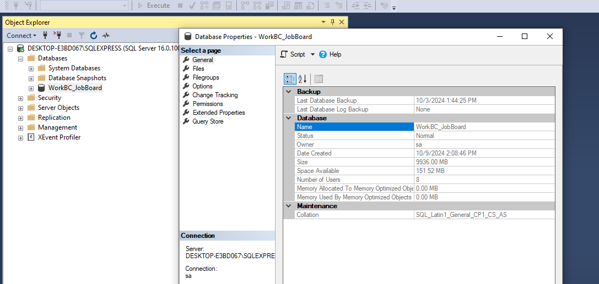
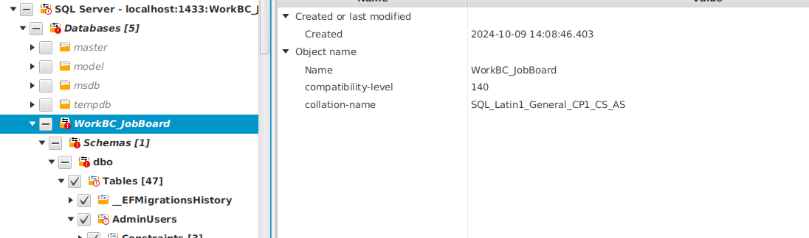
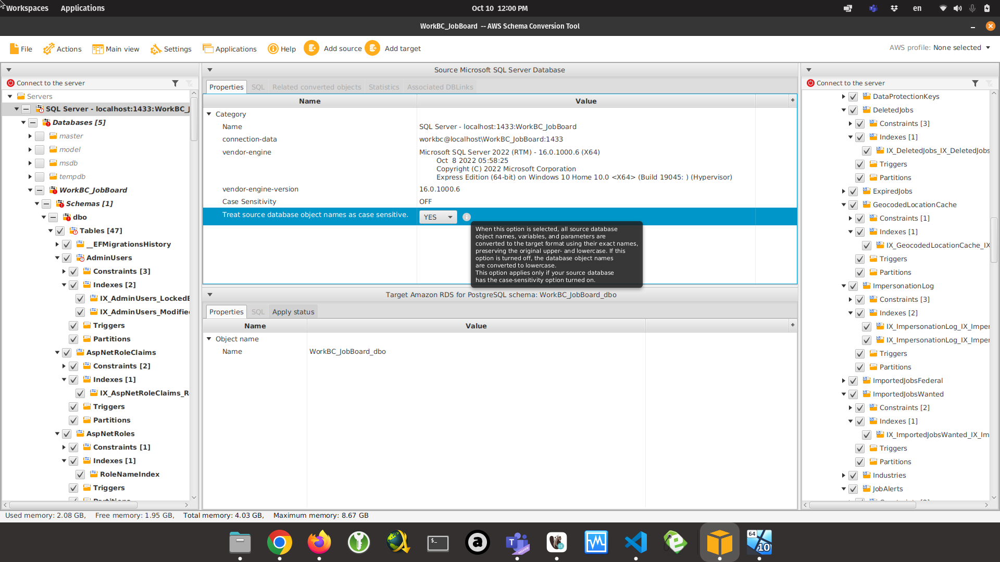
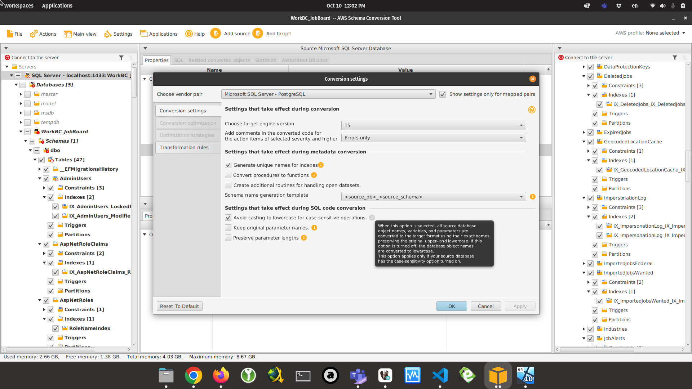

Migrating Job Board database from Microsoft SQL Server (MSSQL) to PostgreSQL (PgSQL)
==========================================

## Procedure overview
In order to manually migrate the database, the following steps are needed:
- Recreate the MSSQL schema into PgSQL
- Export the MSSQL data to CSV
- Import the CSV into PgSQL

**IMPORTANT** The scripts used in this document assume that the source Job Board MSSQL database is called `WorkBC_JobBoard`. The target Job Board PgSQL database will be called `jobboard`.

## 1. Recreate the MSSQL schema into PgSQL
AWS Schema Conversion Tool (SCT) is used to migrate the schema. Because **.NET expects database object names to be case-sensitive**, the default migration settings of SCT need to be adjusted to ensure case sensitivity is maintained. This step also involves changes at the level of the source MSSQL database itself: **The collation of the source database needs to be case-sensitive** in order for SCT to be able to migrate the schema with case sensitivity. [Read more about case sensitivity differences between MSSQL and PgSQL here](https://docs.aws.amazon.com/dms/latest/sql-server-to-aurora-postgresql-migration-playbook/chap-sql-server-aurora-pg.sql.casesensitivity.html).

### 1.1. Adjust MSSQL database collation
- Open Microsoft SQL Server Management Studio (SSMS)
- Connect to the server running the JobBoard database with a user with permission to alter any database (e.g. `sa`)
- Run the following script: `src/scripts/migration/sql/mssql-alter-collation.sql` and ensure the script succeeds
- Run the following script: `src/scripts/migration/sql/mssql-recreate-indexes.sql` and ensure the script succeeds
- Right-click `WorkBC_JobBoard` database > **Properties** and ensure that **General** > **Maintenance** > **Collation** is `SQL_Latin1_General_CP1_CS_AS`



### 1.2. Prepare schema conversion
- Start a PgSQL server and create a database called `jobboard`
- Install [AWS Schema Conversion Tool](https://docs.aws.amazon.com/SchemaConversionTool/latest/userguide/CHAP_Installing.Procedure.html)
- **Add source** > **Microsoft SQL Server** > Enter connection parameters to `WorkBC_JobBoard`
- In the source-side tree, unselect the root **SQL Server** and select the following items from **WorkBC_JobBoard** > **Schemas** > **dbo**
  - **Tables**
  - **Procedures** (only `usp_GenerateJobSeekerStats` and `usp_GenerateJobStats`)
  - **SQL inline functions** (only `tvf_GetJobSeekersForDate` and `tvf_GetJobsForDate`)
- **Add target** > **Amazon RDS for PostgreSQL** > Enter connection parameters to `jobboard`
- Click source-side **WorkBC_JobBoard** database and ensure that **Properties** > **collation-name** is is `SQL_Latin1_General_CP1_CS_AS`



- Click source-side **SQL Server** root and set **Treat source database object names as case sensitive** to **YES**



- Open **Settings** > **Conversion settings** and check **Settings that take effect during SQL code conversion** > **Avoid casting to lowercase for case-sensitive operations.**



- Expand the source-side **WorkBC_JobBoard** > **Schemas** > **dbo** > **Tables** and repeat the following procedure for EVERY INDEX in each table. For example: **AdminUsers** > **Indexes [2]**:
  - Click `IX_AdminUsers_LockedByAdminUserId`
  - Edit the **SQL** tab in **Target Amazon RDS for PostgreSQL schema: WorkBC_JobBoard_dbo**
  - Change each column name in the script to add quotes around the column name, e.g.
```sql
USING BTREE (LockedByAdminUserId ASC);
```
becomes
```sql
USING BTREE ("LockedByAdminUserId" ASC);
```

### 1.3. Run the conversion
- Click source-side **WorkBC_JobBoard** database and click **Actions** > **Convert schema**
- Verify that a new **WorkBC_JobBoard_dbo** schema has been added to the target-side **PostgreSQL `jobboard`** database
- Right-click **WorkBC_JobBoard_dbo** > **Apply to database**
- Ensure all entries below **WorkBC_JobBoard_dbo** are free of warning sign (red exclamation icon)

## 2. Export the MSSQL data to CSV
- Install [DBeaver](https://dbeaver.io/download/)
- Create a new database connection > SQL Server > Enter connection parameters to `WorkBC_JobBoard`
- Click `WorkBC_JobBoard` > `Schemas` > `dbo`
- Select all tables (Ctrl-A) and right-click > **Export data**
- **Export target** > **CSV**
- **Extraction settings** > No change
- **Format settings** > No change
- **Output** > Select **Directory** as a suitable directory to receive the 47 CSV files
- **Confirm** > **Proceed**

## 3. Import the CSV into PgSQL
- In DBeaver, create a new database connection > PostgreSQL > Enter connection parameters to `jobboard`
- Restore the database schema using `docker-compose-jb exec -T postgres psql -U workbc jobboard < scripts/migration/sql/pgsql-schema.sql`
- For each table in the appendix:
  - Right-click table > **Import Data**
  - **Import source** > **CSV** and select the corresponding CSV file
  - **Input file(s)** > **Importer settings** > Click **Set empty strings to NULL** to show **[v]** (only for the first time, as the setting will remain checked from now on)
  - **Tables mapping** > If any column is marked as Skip below, expand the Source and change its **Mapping** entry from `existing` to `skip`
  - **Data load settings** > No change
  - **Confirm** > **Proceed**

- TODO Import `SystemSettings`
- TODO Import `AdminUsers.LockedByAdminUserId` and `AdminUsers.LockedByAdminUserId`

## Appendix: Tables and CSV restore instructions

| File | Restore instructions |
| ---- | ------- |
| ___EFMigrationsHistory | |
| AdminUsers | Skip `Id`, `LockedByAdminUserId`, `ModifiedByAdminUserId` |
| Countries | |
| Regions | |
| Provinces | |
| Locations | |
| Industries | |
| NocCodes | |
| NocCodes2021 | |
| NocCategories | |
| NocCategories2021 | |
| SecurityQuestions | |
| JobSeekerStatLabels | |
| WeeklyPeriods | Skip `Id` |
| DataProtectionKeys | Skip `Id` |
| GeocodedLocationCache | Skip `Id` |
| AspNetUsers | |
| ImpersonationLog | |
| JobSeekerAdminComments | Skip `Id` |
| JobSeekerChangeLog | Skip `Id` |
| JobSeekerEventLog | Skip `Id` |
| JobSeekerFlags | Skip `Id` |
| JobSeekerStats | |
| JobSeekerVersions | Skip `Id` |
| JobAlerts | Skip `Id` |
| JobSources | |
| ReportPersistenceControl | |
| JobStats | |
| JobIds | |
| Jobs | |
| JobVersions | Skip `Id` |
| JobViews | |
| SavedJobs | Skip `Id` |
| SavedCareerProfiles | Skip `Id` |
| SavedIndustryProfiles | Skip `Id` |
| ImportedJobsFederal | |
| ImportedJobsWanted | |
| DeletedJobs | |
| ExpiredJobs | |
